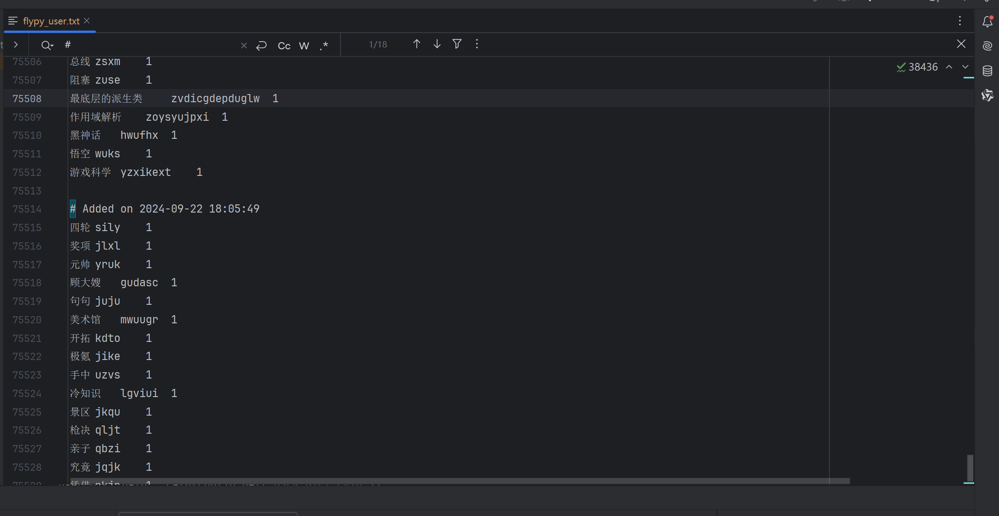

# NewWordSpider


[](https://hits.seeyoufarm.com)
[](https://github.com/hiddenblue/NewWordSpider/actions/workflows/docker-image.yml)

## 功能

- 从指定的 API 获取新词。
- 将新词添加到用户词典中。
- 支持定时运行。


## 1. 项目概述
   本项目旨在通过爬取特定网站的内容，提取新词，并将其转换为**小鹤双拼**格式
   最终保存到Rime用户词库中。
   项目支持使用 jieba 分词和 DeepSeek API 进行分词，并提供异步处理功能以提高效率。

### **效果演示**

程序默认会在指定的rime用户词库(默认名称为rime_user_dict.txt)后面附加新词
并且打上时间日期注视，重复的词将不会被重复添加。
同时内置的sqlite数据库会备份老词库，加入新词，防止数据丢失



其中windows的rime用户词库位于用户home目录下的特定位置
"C:\Users\用户名\AppData\Roaming\Rime"

## 2. 项目结构

```bash
project_root
├── main.py
├── tokenizer.py
├── crawler.py
├── RimeUserDict.py
├── PinyinTools.py
├── logger_config.py
├── config.json
└── README.md
```

##   3. 主要文件说明
main.py
主程序入口，负责读取配置文件、爬取新句子、分词、转换拼音、保存词库等操作。

tokenizer.py
分词模块，支持 jieba 分词和 DeepSeek API 分词。提供异步分词功能。

crawler.py
爬虫模块，负责从指定网站爬取新句子。支持不同的解析器策略。

RimeUserDict.py
Rime用户词库管理模块，负责读取、写入、追加和保存Rime用户词库文件和SQLite数据库。

PinyinTools.py
拼音工具模块，负责将汉字转换为拼音，并将全拼转换为小鹤双拼。

config.json
配置文件，包含API URL、API Key、分词模式等配置项。

## 4. 安装与配置
### 4.1 安装依赖
在项目根目录下运行以下命令安装所需的依赖包：


```bash
git clone https://github.com/hiddenblue/NewWordSpider.git

cd NewWordSpider

pip install -r requirements.txt
```
建议使用conda等环境进行依赖管理。

### 4.2 配置文件
在 config.json 文件中配置以下参数：

```json
{
   "LLM_API_URL": "https://api.deepseek.com/chat/completions",
   "LLM_API_KEY": "",
   "USER_DICT_PATH": "./flypy_user.txt",
   "USER_DICT_DB_PATH": "./flypy_user.db",
   "SPLIT_WORDS_MODE": "deepseek",
   "LOGGING_LEVEL": "INFO",
   "run_interval": 86400
}
```
API_URL : DeepSeek API 的 URL。,当然你也可以用其他LLM的api

API_KEY : DeepSeek API Key。

SPLIT_WORDS_MODE : 分词模式，可选值为 deepseek 或 jieba。

USER_DICT_PATH : Rime 用户词库文件路径。

USER_DICT_DB_PATH : SQLite 数据库文件路径。

### 4.3 运行项目
在项目根目录下运行以下命令启动项目：

```bash
python main.py
```
### 4.4 分词模式
项目支持两种分词模式：

deepseek : 使用 DeepSeek API 进行分词。
jieba : 使用 jieba 进行分词。
分词模式在 config.json 文件中配置。

## 5. 使用 Docker

1. 手动构建 Docker 镜像：

```shell
git clone https://github.com/hiddenblue/NewWordSpider.git
cd NewWordSpider
docker build -t newwordspider .
docker run -d --name newwordspider newwordspider
```

2. 使用 Docker Compose

确保config.json和Docker-compose.yml文件在同一目录下。

```yaml
services:
  newwordspider:
    image: newwordspider:latest
    build:
      context: .
      dockerfile: Dockerfile
    volumes:
      - ./config.json:/app/config.json
    environment:
      - RUN_INTERVAL=86400
    restart: unless-stopped
```

然后运行
```shell
docker-compose up -d 
```


